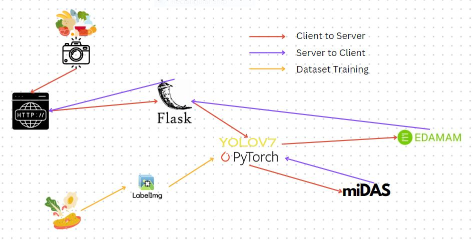
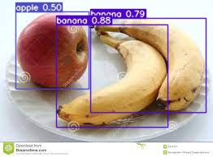
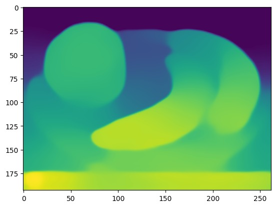
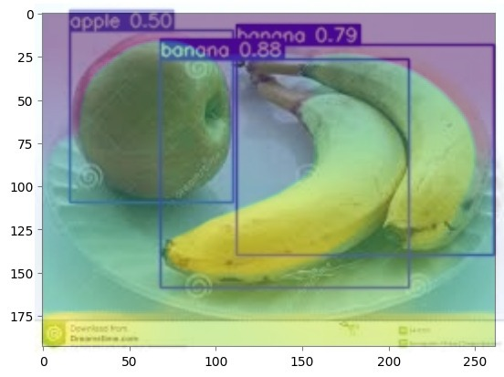
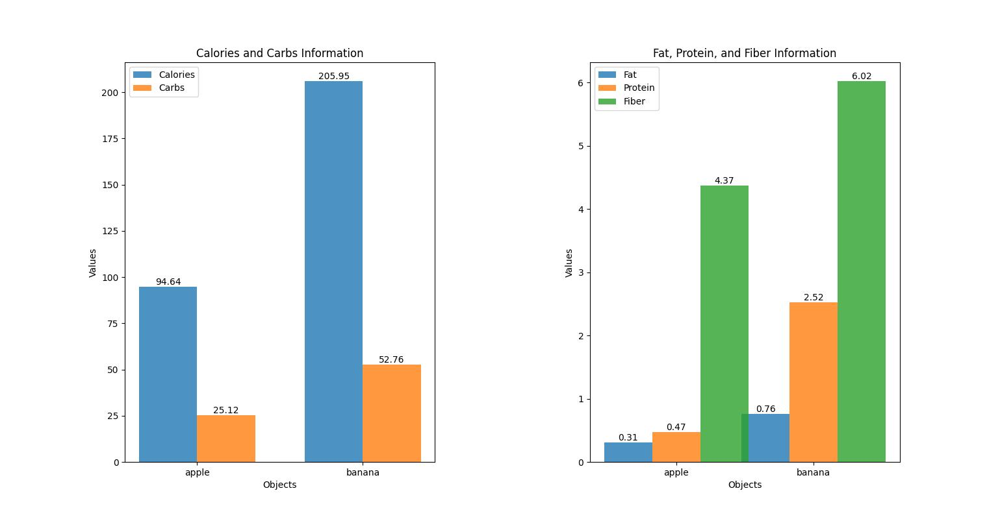

# README ON WEIGH MY PLATE

## ABSTRACT

This research presents an innovative approach to food detection and nutritional analysis using a combination of YOLO (You Only Look Once) object detection and depth sensing technology. The proposed model integrates computer vision techniques to identify and locate food items within images, followed by depth detection to estimate volume and weight. The obtained depth information is leveraged to enhance the accuracy of nutritional parameter estimation, including calorie content and other essential nutritional values.

With accurate volume and weight estimations, the model advances to the nutritional analysis phase. Leveraging a comprehensive food database, the system correlates the identified food items with their nutritional profiles, enabling the determination of essential parameters such as calories, protein content, fat content, carbohydrate content, and fiber content.

## METHODOLOGY

### A. Data Acquisition:

The dataset comprises a custom dataset created by the team members. This dataset consists of images belonging to different classes such as Apple, Banana, Burger, Rice, etc.

### B. Image Preprocessing:

Image deletion is performed to sort out any unusable images.

### C. Labelling of the Dataset:

The graphical image annotation tool named LabelImg is used for labelling of the images. The images are labelled by creating a boundary box or rectangular box around the object in the image. The annotations are saved as txt file or xml file in Yolo format.

### D. YOLO Detection Model:

YOLO (You Only Look Once) is an algorithm for object detection in real time. YOLO applies a single neural network to the image, then divides the image into regions and predicts a bounding box for each possible region. YOLO can be applicable to multiple objects in a single image and able to predict multiple bounding boxes and class probabilities for those boxes.

#### YOLO Algorithm works according to the following three techniques:

1. **Bounding Box Prediction:**
   YOLO divides the input image into a grid, creating a set of grid cells. Each grid cell is responsible for predicting multiple bounding boxes. For each bounding box, the model predicts:
   - Coordinates (x, y, width, height):
     - (x, y): The coordinates of the bounding box's centre relative to the grid cell's top-left corner.
     - (width, height): The width and height of the bounding box relative to the dimensions of the grid cell.

2. **Class Probability and Objectness:**
   For each bounding box, YOLO predicts:
   - Class Probabilities: The model assigns class probabilities to each object class for the given bounding box. These probabilities represent the likelihood of the object belonging to a particular class.
   - Objectness Score: The objectness score indicates the confidence that an object is present within the bounding box. It assesses whether the bounding box contains a meaningful object or is just a false positive.

3. **Non-Maximum Suppression (NMS):**
   After obtaining predictions for multiple bounding boxes, NMS is applied to filter out redundant and overlapping predictions. The process involves:
   - Sorting Predictions: Sort all predictions based on their confidence scores in descending order.
   - Selecting the Most Confident Prediction: Choose the bounding box with the highest confidence score as a detection.
   - Suppressing Overlapping Predictions: Remove predictions that have a high intersection-over-union (IOU) with the selected bounding box.

### E. Depth Estimation:

Following the retrieval of object coordinates from YOLO, we employ MiDAS to estimate the volume of food items in the dataset. MiDAS, which stands for Monocular Depth by Autoencoding Sparse Structured Light, is a deep learning-based methodology for monocular depth estimation.

#### Key Steps in MiDAS:

- Sparse Structured Light Information: MiDAS incorporates sparse structured light information into the depth estimation process. Structured light refers to the projection of known patterns onto a scene. This structured light information aids in capturing depth details by creating distinctive patterns on the surfaces.
- Convolutional Neural Network Architecture: MiDAS employs a CNN architecture designed to learn complex mappings between RGB images and corresponding depth maps. The architecture typically involves encoder and decoder components, allowing the network to capture hierarchical features from the input images and generate detailed depth predictions.
- Depth Map Prediction:

    
    
  

Having previously defined bounding boxes for each object class in our custom object detection model, we leverage these coordinates to determine the midpoint of each bounding box. This midpoint serves as our estimated point for calculating the depth of the object. Subsequently, we compute the area of the bounding box, and this information is mapped to a numpy array to obtain the relative depth of the object. With the acquired depth information, we proceed to calculate the volume of the object by combining the deduced area and depth. From this, we can easily deduce the weight of each object identified.

### F. Calorie Detection:

After detecting the objects and their respective weights, the script assembles an API request directed to Edamam, supplying the name of the detected object. In return, the API furnishes nutritional details encapsulated in a JSON response. The nutritional values (calories, protein, fat, carbs, fiber) are extracted from the JSON response and used for further analysis.

#### API Configuration:

The script uses an API configuration stored in a separate `secret.py` file (not provided). This file likely contains API endpoint URLs, authentication details, and other necessary information. The API dictionary stores the configuration for different APIs, and the `make_request` function is responsible for making HTTP requests to these APIs.

#### Fetching Nutritional Information:

The `make_request` function takes an API name, parameters, and headers, then constructs and sends an HTTP GET request using the `requests` library. The `get_response` function (not provided) is used to parse the API response and return a dictionary with relevant information.

### G. Visualization Of Data:

The grouped bar chart visually represents nutritional information for different food objects. In the first subplot, it showcases the distribution of Calories and Carbs across multiple objects, providing a comparative view of their values. The second subplot extends the analysis by illustrating the levels of Fat, Protein, and Fiber for each object. The height of each bar corresponds to the respective nutrient value, with labels on top of each bar displaying the precise numeric values. This graphical representation offers a clear and concise overview, enabling easy comparison of nutritional content among different food items.
